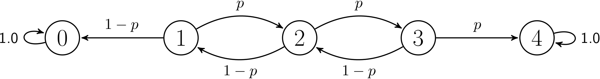

# Simulating a gambler

The 1D random walk can be used to model how a gambler plays a game such as roulette in a casino.  The idea in such games is that the gambler places a small stake on each game.  Lets suppose this is a stake of one pound.  When the game is played the gambler will either loose their stake and the total amount of money he has will thus decrease by one unit.  Alternatively, he will win the game and in that case he wins back his stake and a prize, which we will set as one pound.  If he wins the game he will thus have one pound than the amount of money that he came in with.  As you can see if the gambler repeats this process of staking money and playing the amount of money he has will undergo a random walk in one dimension.

Importantly there is a difference between the gambler and the 1D random walk, however.  The gambler usually only has a finite amount of money to gamble with.  If he looses a large number of games he is therefore forced to stop playing.  Similarly, the gambler may also have some target for how much money he would like to win.  In other words, he should have some figure N pounds, which is more than the amouont of money he entered the casino with.  He will stop gambling once he has N pounds in his pocket.

The amount of money that the gambler has is an example of a stochastic process.  A stochastic process is for want of a better description a time-dependent random variable. Furthermore, the amount of money the gambler has is an example of a special kind of stochastic process that is known as a Markov chain.  We can thus illustrate the behaviour of the stochastic process by using a diagram similar to the one below:

The circles here represent the various numbers of pounds the gambler might have.  The arrows meanwhile show the amounts of money that the gambler might have after each gamble.  As you can see the nodes in the centre of the chain (nodes 1, 2 and 3) are connected to the adjacent nodes as on each game he will either loose or win one pound.  Importantly, however, the nodes at the two ends of the chain are only connected to themselves.  These nodes are this way because once the gambler has zero or N pounds he will no longer play (N is founr in this figure).  The amount of money he owns will thus cease to change.

A question that might be of interest is whether the gambler leaves the casino with zero pounds or whether he leaves with N pounds.  We can answer this question by running a simulation of the gambler.  Essentially we start the gambler with `s` pounds and simulate the process of him playing the game only stopping once he has zero  or `n` pounds.  We can then set a random variable equal to 1 if he has 0 pounds and 1 if he has `n` pounds.

__Your task in this exercise is to write a function called `gambler` that simulates this procedure.__ Your function should take three arguments:

1. `start` the amount of money the gambler starts with.  This should be a positive number
2. `n` the target amount of money that the gambler wants to win.  The gambler should stop playing once he has `n` pounds or when he runs out of money and has zero pounds.
3. `p` the probability of winning each individual game the gambler plays.  If the gambler wins a game the amount of money he has increases by one pound.  If he looses the amount of money he has decreases by one pound.

Within the function the random 1D walk should be simulated until the walker arrives in state 0 or in state N.  If the walk finishes with the walker arriving in state 0 the function should return 1.  If the walk finishes with the walker arriving in state N the function should return 0.
